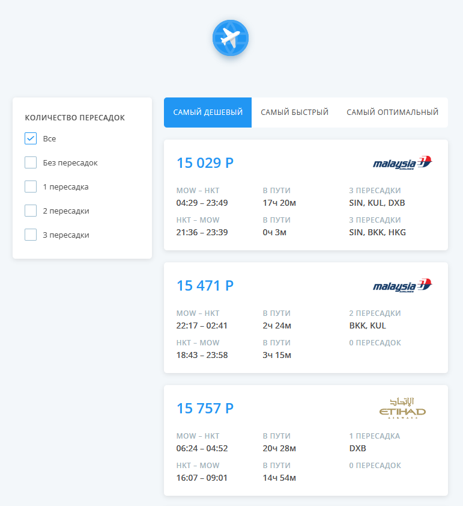

# React-Aviasales

## Quick Overview

This project was created by this task --> https://github.com/KosyanMedia/test-tasks/tree/master/aviasales_frontend

## Stack

| Technology | Description |
| ------ | ----------- |
| React   | A JavaScript library for building user interfaces. |
| MobX | Simple, scalable state management. |
| Typescript    | Strongly typed programming language which builds on JavaScript. |
| Webpack    | Module bundler. |
| Sass    | CSS extension language. |

## How it launch?

1. Clone repository

```console
git clone https://github.com/AntonZelenkov1997/react-aviasales.git
```

2. Install dependencies (with yarn or npm)
   
```console
yarn install / npm install
```

3. Make a build or run dev build

```console
yarn run build / npm run build
```

```console
yarn run start / npm run start
```

## Demo

